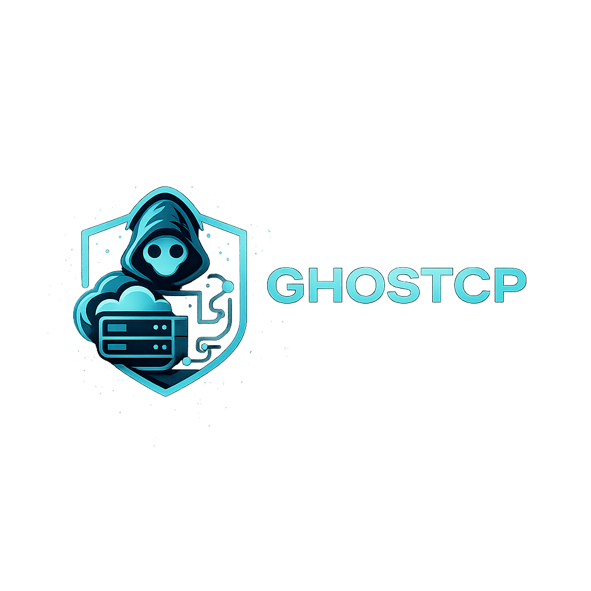

<p align="center">
  
</p>

<p align="center">
  <strong>A Rust host-level hosting control panel — HestiaCP reimagined with Axum, Leptos &amp; standards-based DNS.</strong>
</p>

<p align="center">
  
  
  
  
  <br>
  
  
  
  <br>
  <a href="docs/security/"></a>
  <a href="LICENSE"></a>
</p>

---

> **Disclaimer — Experimental.** GhostCP is under active development and intended
> for research, learning, and personal lab use. Interfaces, schema, and APIs may
> change without notice; do not run it on production hosts you cannot afford to
> rebuild.

---

## Overview

GhostCP is a **host-level control panel** written in Rust. It manages a single
server's web, DNS, mail, database, and TLS configuration the way HestiaCP does —
by templating native services (NGINX, PHP-FPM, BIND/PowerDNS, Postfix/Dovecot)
and driving them with systemd — but with a memory-safe Rust control plane, a
PostgreSQL system-of-record, and a Leptos web UI.

The project favors **standards-based interoperability** over proprietary
clustering: authoritative DNS speaks AXFR/IXFR, NOTIFY, and TSIG so a GhostCP
primary can mix-and-match secondaries (BIND, PowerDNS, Technitium) instead of
locking you into one stack.

GhostCP is **API-first**. The HTTP API is the contract; the web UI and any future
CLI are clients of it.

## Status

GhostCP is early. The control plane, authentication, and DNS subsystem are
functional; most resource managers are scaffolded with working routes and schema
but stubbed business logic. The table below is the honest state of the tree.

| Area | State | Notes |
|------|-------|-------|
| Auth (JWT + Argon2) | **Implemented** | login, register, refresh, logout, `me`, change-password |
| Two-factor auth (TOTP) | **Implemented** | enrol, verify, disable, backup codes |
| Users | **Partial** | list / create / get; update stubbed |
| DNS zones & records | **Implemented** | CRUD, sync, AXFR, DNSSEC |
| DNS drivers | **Implemented** | Cloudflare, PowerDNS, local (BIND), advanced/DNSSEC |
| Monitoring | **Implemented** | system metrics + Prometheus `/api/v1/metrics` |
| Web domains | **Scaffolded** | routes + schema; NGINX templating not yet wired |
| Mail | **Scaffolded** | routes + schema; Postfix/Dovecot templating not yet wired |
| Databases | **Scaffolded** | routes + schema |
| SSL / ACME | **Scaffolded** | Let's Encrypt + DNS-01/HTTP-01 drivers present, not fully wired |
| Backups / Cron / Jobs | **Scaffolded** | routes + schema |
| Web UI (Leptos) | **In progress** | SSR + hydration build green; views render mock data |

See [`CHANGELOG.md`](CHANGELOG.md) for versioned history.

## Features

### Standards-based authoritative DNS
First-class DNS is the headline. GhostCP manages zones and records and
interoperates with existing nameservers through open protocols rather than a
bespoke replication channel:

- BIND9 authoritative + Unbound recursive/validating reference layout
- Zone transfer via **AXFR/IXFR**, change push via **NOTIFY**, authenticated by **TSIG**
- Mix secondaries freely — e.g. `ns1` GhostCP, `ns2` PowerDNS or Technitium
- **DNSSEC** signing and key management
- Pluggable provider drivers: Cloudflare API, PowerDNS API, local BIND

See [docs/dns/authoritative-interop.md](docs/dns/authoritative-interop.md).

### Static sites & WordPress hosting
Web hosting targets two workloads as first-class citizens:

- **Static sites** — NGINX vhost templates, automatic TLS, HTTP/2
- **WordPress** — isolated PHP-FPM pools per site, multisite and Bedrock layouts
- **TLS via ACME** — Let's Encrypt with both **DNS-01** (wildcards) and
  **HTTP-01** validation; acme.sh backend planned

See [docs/websites/](docs/websites/) and [docs/dns/acme.md](docs/dns/acme.md).

### Control plane
- Rust / Axum API with JWT sessions and Argon2 password hashing
- TOTP two-factor authentication with recovery codes
- Role-based access model (admin / user)
- PostgreSQL system-of-record with SQLx migrations
- Prometheus metrics endpoint for scraping

### Mail, databases, backups
Schema and routes exist for Postfix/Dovecot mail, MySQL/PostgreSQL databases,
and Restic-style backups. These are scaffolded — track progress in the status
table and changelog.

## Architecture

```
                 ┌──────────────┐
   Browser  ───► │  Leptos UI   │  SSR + WASM hydration
                 └──────┬───────┘
                        │  HTTP (JSON)
                 ┌──────▼───────┐
                 │  Axum API    │  JWT auth, RBAC, jobs
                 │ (ghostcp-api)│
                 └──┬────────┬──┘
          SQLx      │        │   templates + systemd
        ┌───────────▼┐   ┌───▼─────────────────────────┐
        │ PostgreSQL │   │ NGINX · PHP-FPM · BIND/PDNS  │
        │  (truth)   │   │ Postfix · Dovecot · ACME     │
        └────────────┘   └─────────────────────────────┘
```

- **Control plane:** `api/` — Axum, SQLx, Tokio
- **Web UI:** `ui/` — Leptos 0.8 (SSR + islands)
- **State:** PostgreSQL — the single source of truth
- **Service config:** Tera templates under `templates/` rendered to native config
- **Drivers:** DNS (Cloudflare/PowerDNS/local) and ACME (Let's Encrypt) under `api/src/drivers/`

Production is a **host install** (script + systemd), not a container orchestration
target. Docker is provided for development and testing only.

## Quick Start (development)

The `docker/` stack runs PostgreSQL and the API with **host networking** for
local development. It is not a production deployment.

```bash
git clone <repository-url>
cd GhostCP

cp .env.example .env          # adjust DATABASE_URL / secrets as needed

docker compose -f docker/compose.yml up
```

The API listens on the port from `.env` (`PORT=8080` by default):

```bash
curl http://localhost:8080/health
```

Running the API directly against a local PostgreSQL:

```bash
cargo run -p ghostcp-api      # migrations apply on startup
```

Building the UI:

```bash
cargo build -p ghostcp-ui --features ssr
cargo build -p ghostcp-ui --no-default-features --features hydrate \
  --target wasm32-unknown-unknown
```

More detail in [docs/development/](docs/development/) and
[docs/getting-started/](docs/getting-started/).

## Documentation

The complete documentation set lives under [`docs/`](docs/README.md) — start at
the [documentation hub](docs/README.md) for the full index.

| Section | Key pages |
|---------|-----------|
| [Getting Started](docs/getting-started/) | [Installation](docs/getting-started/installation.md) · [Configuration](docs/getting-started/configuration.md) · [Quick Start](docs/getting-started/quick-start.md) |
| [Architecture](docs/architecture/) | [Overview](docs/architecture/overview.md) · [Templating](docs/architecture/templating.md) · [Jobs](docs/architecture/jobs.md) |
| [API](docs/api/) | [Reference](docs/api/README.md) · [Authentication](docs/api/authentication.md) |
| [Websites](docs/websites/) | [Static Sites](docs/websites/static-sites.md) · [WordPress](docs/websites/wordpress.md) |
| [DNS](docs/dns/) | [Zones & Records](docs/dns/zones-and-records.md) · [Authoritative Interop](docs/dns/authoritative-interop.md) · [DNSSEC](docs/dns/dnssec.md) · [ACME](docs/dns/acme.md) |
| [Mail](docs/mail/) | [SMTP/IMAP](docs/mail/smtp-imap.md) · [Authentication](docs/mail/authentication.md) |
| [Databases](docs/databases/) | [Overview](docs/databases/README.md) |
| [Backups](docs/backups/) | [Overview](docs/backups/README.md) |
| [Security](docs/security/) | [RBAC](docs/security/rbac.md) · [2FA](docs/security/two-factor-auth.md) · [Hardening](docs/security/hardening.md) · [CrowdSec](docs/security/crowdsec.md) · [Threat Feeds](docs/security/threat-feeds.md) |
| [Observability](docs/observability/) | [Logging](docs/observability/logging.md) · [Metrics](docs/observability/metrics.md) · [SIEM (Wazuh)](docs/observability/siem-wazuh.md) |
| [Deployment](docs/deployment/) | [Requirements](docs/deployment/requirements.md) · [Install Script](docs/deployment/install-script.md) · [systemd](docs/deployment/systemd.md) · [Tailscale](docs/deployment/tailscale.md) · [Proxmox Firewall](docs/deployment/proxmox-firewall.md) · [Distributed](docs/deployment/distributed.md) |
| [Development](docs/development/) | [Docker](docs/development/docker.md) · [Building](docs/development/building.md) · [Testing](docs/development/testing.md) |

## Security

Security policy and reporting instructions are in [`SECURITY.md`](SECURITY.md).
Do not file public issues for vulnerabilities.

## Contributing

See [`CONTRIBUTING.md`](CONTRIBUTING.md) for the development workflow, coding
standards, and pull-request process.

## License

Licensed under the [MIT License](LICENSE).

---

<p align="center">
  ⚡ Built with Rust, Leptos, Axum &amp; PostgreSQL
</p>
