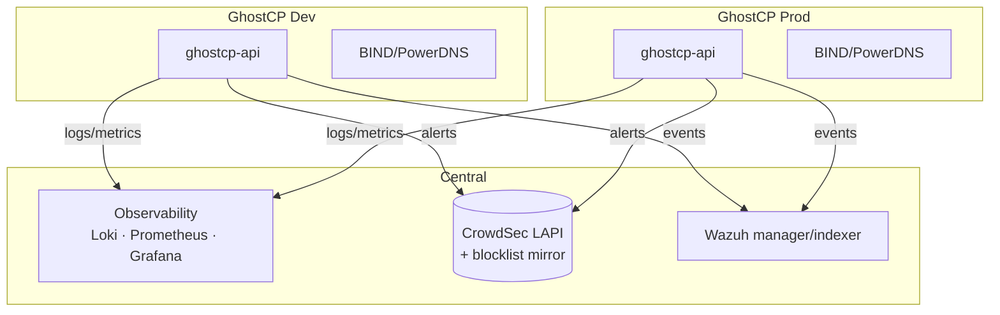
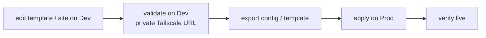

# Distributed deployment (Dev ↔ Prod)

> **Topology guidance — planned tooling.** GhostCP installs one panel per host.
> This page describes how multiple GhostCP hosts — and a separate **Dev** and
> **Prod** environment — relate to each other and to shared central services.
> The cross-host *promotion* tooling is planned; the building blocks (standards
> DNS interop, central observability, central IPS) exist as documented
> integrations.

GhostCP is host-scoped by design. "Distributed" does not mean a clustered control
plane — it means **several independent GhostCP hosts** that share standards-based
plumbing and feed common central services.

## Environments

Run Dev and Prod as separate GhostCP hosts (or VMs), never the same box:

| Environment | Purpose | Exposure |
|-------------|---------|----------|
| **Dev** | staging sites, template/config changes, upgrade rehearsal | private ([Tailscale](tailscale.md)) |
| **Prod** | live sites, authoritative DNS, production mail | public service ports; admin private |

Keep their databases and config fully separate — PostgreSQL is the source of
truth **per host**. There is no shared control-plane DB.

## Shared central services

What Dev and Prod *share* is the central infrastructure, each as a **source**:

Both environments ship telemetry to the same
[observability stack](../observability/README.md), register against the same
[CrowdSec LAPI](../security/crowdsec.md), and report to the same Wazuh manager —
so you watch the whole estate in one Grafana while each host enforces locally.

## DNS across environments

Use the standards-based [authoritative interop](../dns/authoritative-interop.md)
model rather than any proprietary sync:

- **Prod** runs the authoritative primary (`ns1`); secondaries (Technitium /
  PowerDNS / BIND) pull zones via AXFR/IXFR with NOTIFY and TSIG.
- **Dev** runs its own isolated zones (e.g. a `dev.` subdomain or split-horizon)
  so staging never answers for production names.

## Promotion flow (Dev → Prod)

The intended workflow once promotion tooling lands:

Until then, promotion is manual: changes proven on Dev (NGINX/PHP templates, DNS
record sets, mail config) are reproduced on Prod through the same API/CLI steps.
Because both hosts render from the **same templates**, a change validated on Dev
applies predictably on Prod.

## Admin access

Expose only public *service* ports (80/443/53/25/587/465/143/993) on Prod. Keep
each host's **admin panel and SSH private** — bind the panel to localhost behind
the [reverse proxy](reverse-proxy.md) and reach it over
[Tailscale](tailscale.md). Dev is private end-to-end.

## Related

- [Tailscale](tailscale.md) — private management plane for Dev and Prod admin
- [Observability](../observability/README.md) — shared telemetry sinks
- [CrowdSec](../security/crowdsec.md) — shared IPS decisions/blocklists
- [Authoritative interop](../dns/authoritative-interop.md) — cross-host DNS
- [Proxmox firewall](proxmox-firewall.md) — per-VM exposure control
