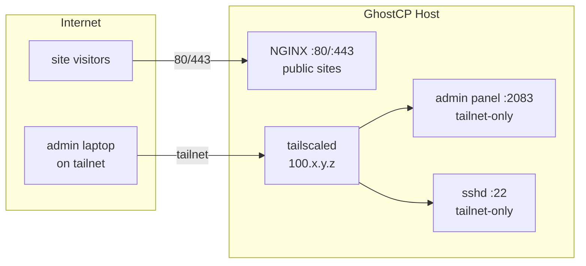

# Tailscale — private management plane

> **Integration design — planned tooling.** Tailscale is not bundled. This page
> shows how to put GhostCP's **management surface** (admin panel + SSH) on a
> private Tailscale network while leaving hosted sites public. The NGINX and
> firewall pieces it builds on exist today; GhostCP-managed automation of this is
> planned.

A GhostCP host has two very different audiences:

- **Public:** the sites it serves — WordPress, static sites, mail, DNS. These
  must answer the whole internet on 80/443/53/25/etc.
- **Private:** the GhostCP **admin panel** and **SSH**. Only you should reach
  these.

The clean split is to keep all public *service* ports open and move the *admin*
plane onto a [Tailscale](https://tailscale.com) tailnet, reachable only over the
`100.64.0.0/10` CGNAT range (or your tailnet's MagicDNS names). Public visitors
never see the panel; admins reach it over WireGuard.



## Conventions used here

- The **public** panel/admin entry is `https://<host>:2083` (separate from the
  public site vhosts on 443).
- The `ghostcp-api` stays bound to `127.0.0.1:8080`; the panel vhost reverse-
  proxies to it (see [reverse proxy](reverse-proxy.md)).
- `100.64.0.0/10` is Tailscale's address range; substitute your actual tailnet
  CIDR / MagicDNS names.

## 1. Lock SSH to the tailnet

Bind `sshd` to the Tailscale interface only, so port 22 simply does not exist on
the public IP. In `/etc/ssh/sshd_config.d/10-tailscale.conf`:

```
# replace with this host's Tailscale IP (tailscale ip -4)
ListenAddress 100.64.0.10
```

Then drop public 22 at the firewall. With nftables/UFW on the host:

```bash
ufw allow in on tailscale0 to any port 22 proto tcp
ufw deny  in on eth0       to any port 22 proto tcp
```

### PVE firewall tie-in

If the host is a Proxmox VM, do the same at the PVE layer — only allow 22 from
your tailnet, not the world. In an IPSet + rule (see
[Proxmox firewall](proxmox-firewall.md)):

```
# Datacenter → Firewall → IPSet "tailnet": 100.64.0.0/10
IN  ACCEPT  -p tcp --dport 22  -source +tailnet
```

Because Tailscale is WireGuard over UDP 41641 (and falls back through DERP), the
only inbound *public* port Tailscale itself may want is UDP 41641; everything
else (SSH, panel) rides the encrypted tunnel.

## 2. Put the admin panel on 2083, tailnet-only

Serve the panel on `:2083` but **bind that listener to the Tailscale IP**, so the
admin portal is unreachable from the public interface. Public site vhosts on
80/443 are untouched.

```nginx
# /etc/nginx/conf.d/ghostcp-admin.conf  — admin panel, tailnet only
server {
    # bind ONLY to this host's Tailscale address, not 0.0.0.0
    listen 100.64.0.10:2083 ssl;
    server_name panel.web01.ts.example.ts.net;

    ssl_certificate     /etc/ghostcp/ssl/panel.crt;
    ssl_certificate_key /etc/ghostcp/ssl/panel.key;

    # defense in depth: even on the tailnet interface, allow only tailnet
    allow 100.64.0.0/10;
    deny  all;

    location / {
        proxy_pass http://127.0.0.1:8080;   # ghostcp-api
        proxy_set_header Host              $host;
        proxy_set_header X-Real-IP         $remote_addr;
        proxy_set_header X-Forwarded-For   $proxy_add_x_forwarded_for;
        proxy_set_header X-Forwarded-Proto $scheme;
    }
}
```

Two independent guards: the `listen` is pinned to the Tailscale IP (so the
socket isn't even open on the public NIC), **and** an `allow/deny` ACL restricts
to the tailnet range. Public WordPress/static vhosts remain ordinary
`listen 443 ssl` servers with no such restriction.

Then make sure 2083 is closed publicly at both firewalls:

```bash
ufw allow in on tailscale0 to any port 2083 proto tcp
ufw deny  in on eth0       to any port 2083 proto tcp
```

```
# PVE: do NOT add a public 2083 allow rule; only the tailnet IPSet
IN  ACCEPT  -p tcp --dport 2083  -source +tailnet
```

## 3. Tailscale ACLs (who can reach admin)

Bind/firewall stop the public internet; **tailnet ACLs** scope *which* tailnet
members reach management. In the Tailscale admin console policy:

```jsonc
{
  "tagOwners": { "tag:ghostcp": ["group:admins"] },
  "acls": [
    // only admins reach SSH + panel on GhostCP hosts
    { "action": "accept",
      "src": ["group:admins"],
      "dst": ["tag:ghostcp:22", "tag:ghostcp:2083"] }
  ]
}
```

Tag each GhostCP host (`tailscale up --advertise-tags=tag:ghostcp`) so the policy
applies fleet-wide. Combine with **Tailscale SSH** (`--ssh`) to drop static SSH
keys entirely and authenticate via the tailnet identity.

## 4. `tailscale serve` for the panel (alternative)

Instead of (or alongside) the NGINX admin vhost, `tailscale serve` can expose the
local panel onto the tailnet over HTTPS with an automatic tailnet cert — no
public DNS, no public port:

```bash
# proxy the local API onto the tailnet on 443 with a *.ts.net cert
tailscale serve --bg https / http://127.0.0.1:8080
```

The panel is then reachable only at `https://web01.<tailnet>.ts.net/` from tailnet
devices. Use **`tailscale serve`** (tailnet-private) for the admin panel; never
`tailscale funnel`, which would publish it to the public internet — the opposite
of the goal.

| Tool | Scope | Use for |
|------|-------|---------|
| `tailscale serve` | tailnet-only | the GhostCP admin panel ✅ |
| `tailscale funnel` | public internet | nothing here — sites are served by NGINX directly |

## What stays public vs private

| Surface | Port(s) | Exposure |
|---------|---------|----------|
| Hosted sites (WordPress/static) | 80, 443 | **public** |
| Mail | 25, 587, 465, 143, 993 | **public** |
| DNS | 53 | **public** |
| **GhostCP admin panel** | **2083** | **tailnet-only** |
| **SSH** | **22** | **tailnet-only** |
| `ghostcp-api` (upstream) | 127.0.0.1:8080 | localhost only |

## Related

- [Reverse proxy](reverse-proxy.md) — the panel vhost that fronts `:8080`
- [Proxmox firewall](proxmox-firewall.md) — enforce the same tailnet-only rules
  at the PVE layer
- [Distributed deployment](distributed.md) — Dev is fully private; Prod admin is
  tailnet-only while sites stay public
- [Hardening](../security/hardening.md)
