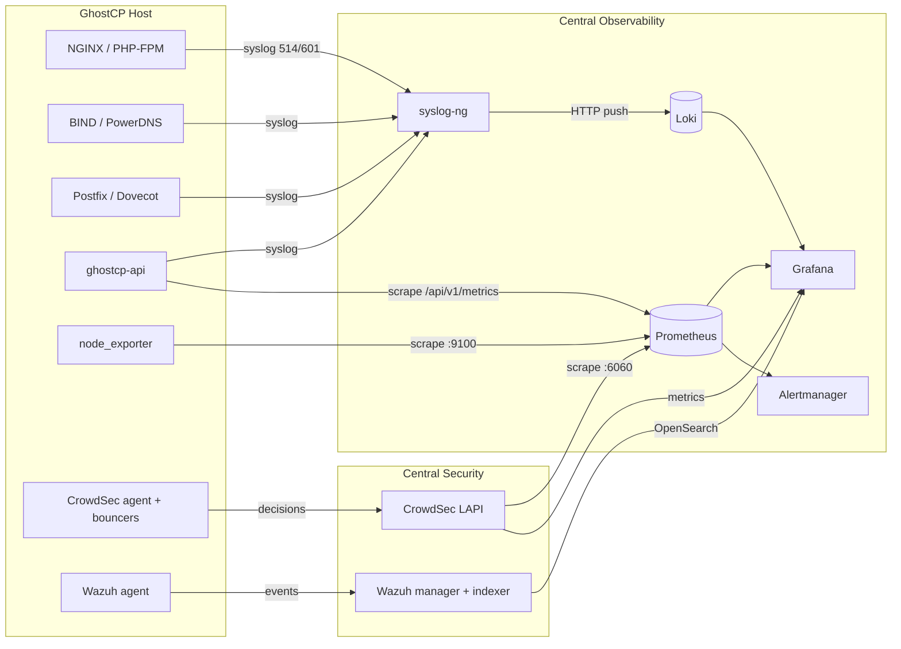

# Observability & Security Telemetry

> **Integration design — planned.** GhostCP exposes a Prometheus metrics endpoint
> today (implemented). The log/SIEM shipping described here is an **integration
> pattern** for plugging a GhostCP host into an external observability/SIEM stack;
> the automated wiring inside GhostCP is planned. Pages mark what's implemented.

GhostCP is a host-level panel that runs privileged services (web, DNS, mail). In
any real deployment those hosts should feed a central **observability and SIEM**
stack rather than being monitored in isolation. GhostCP is designed to be a
**telemetry source** and a **security node** in that ecosystem.

This section documents how a GhostCP host integrates with a central
observability server — a single aggregator running **Loki** (logs),
**Prometheus** (metrics), **Grafana** (visualization), and **Alertmanager**,
reading security signal from a central **CrowdSec** LAPI and a **Wazuh** indexer.

The pattern here mirrors a real deployment: the homelab security/observability
stack documented at [github.com/ghostkellz/arch](https://github.com/ghostkellz/arch)
(see its `security` / heimdall-stack section), and the same approach
**CK Technology LLC** uses to secure and manage production infrastructure — one
central aggregator, many hosts shipping to it.

- [Logging](logging.md) — syslog-ng → Loki pipeline
- [Metrics](metrics.md) — Prometheus scraping (GhostCP `/api/v1/metrics`)
- [SIEM (Wazuh)](siem-wazuh.md) — Wazuh agent → manager/indexer
- Security IPS: [CrowdSec](../security/crowdsec.md) (in the security section)

## The big picture

## Signal types

| Signal | Source on GhostCP host | Transport | Lands in |
|--------|------------------------|-----------|----------|
| **Logs** | NGINX, mail, DNS, auth, `ghostcp-api` | syslog (514/601) | syslog-ng → Loki |
| **Metrics** | `node_exporter`, GhostCP `/api/v1/metrics` | Prometheus scrape | Prometheus → Grafana |
| **IPS decisions** | CrowdSec agent + bouncers | LAPI | CrowdSec LAPI |
| **Security events** | Wazuh agent (FIM, log analysis) | Wazuh protocol | Wazuh manager/indexer |

## Design principles

- **GhostCP hosts are sources, not the aggregator.** The central stack
  (Loki/Prometheus/Grafana, CrowdSec LAPI, Wazuh) lives on its own box; GhostCP
  hosts ship to it. This mirrors the host-install model — one panel per server,
  central visibility across all of them.
- **Low-cardinality log labels.** Ship with stable labels (`host`, `app`,
  `severity`, `source_type`) and keep high-cardinality detail in the log line.
- **Observe-only at the center.** The aggregator reads CrowdSec metrics and Wazuh
  alerts; it does not run those engines. Enforcement happens on the GhostCP host.
