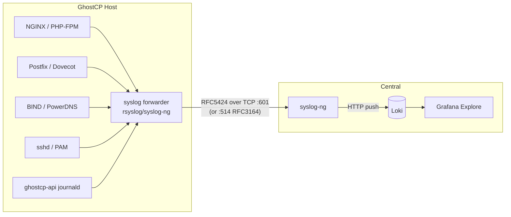

# Logging — syslog-ng → Loki

> **Integration design — planned.** GhostCP's services log to systemd/journald and
> the usual service log files today. The syslog-ng → Loki shipping below is an
> **integration pattern** for forwarding those logs to a [central
> aggregator](README.md). The automated wiring inside GhostCP is planned; the
> pieces it builds on (journald, NGINX/mail/DNS logs) exist today.

A GhostCP host produces several log streams worth centralizing: web (NGINX,
PHP-FPM), mail (Postfix, Dovecot), DNS (BIND/PowerDNS), authentication
(`sshd`, PAM), and the control plane (`ghostcp-api`). Rather than logging into
each host, ship them to a central **syslog-ng → Loki** pipeline and query in
Grafana.

## Pipeline



## Transport

The central syslog-ng aggregator listens on the standard syslog ports:

| Port | Proto | Format | Use |
|------|-------|--------|-----|
| 514 | UDP/TCP | RFC3164 (BSD) | legacy/appliance syslog |
| 601 | TCP | RFC5424 | structured syslog (preferred) |

On the GhostCP host, forward with whatever syslog daemon is present. With
`rsyslog`, forwarding everything to the aggregator over TCP/RFC5424 is one line
in `/etc/rsyslog.d/90-forward.conf`:

```
*.*  @@central.example.internal:601;RSYSLOG_SyslogProtocol23Format
```

`@@` selects TCP; a single `@` would be UDP. Journald-only units (like
`ghostcp-api`) reach syslog via `ForwardToSyslog=yes` in
`/etc/systemd/journald.conf`, or are read directly with a journald source on the
collector.

## Labels: keep cardinality low

Loki indexes **labels**, not log contents. Ship a small, stable label set and
keep the variable detail in the log line. Good labels for a GhostCP fleet:

| Label | Example | Why |
|-------|---------|-----|
| `host` | `web01` | which GhostCP node |
| `app` | `nginx`, `postfix`, `ghostcp-api` | which service |
| `severity` | `info`, `warning`, `error` | syslog priority |
| `source_type` | `web`, `mail`, `dns`, `auth`, `panel` | log family |

Avoid labels with unbounded values — request paths, client IPs, message IDs,
domains. Those belong in the line and are recovered at query time with LogQL
filters/parsers, not as labels.

## Querying in Grafana

Once logs land in Loki, Grafana **Explore** answers operational questions
without SSH:

```logql
# all errors from a host's mail stack in the last hour
{host="mail01", source_type="mail"} |= "error"

# panel API 5xx
{app="ghostcp-api"} | json | status >= 500

# failed SSH auth across the fleet
{source_type="auth"} |= "Failed password"
```

## What's implemented vs planned

- **Implemented today:** services log to journald/files; `ghostcp-api` emits
  structured logs via `tracing` (`RUST_LOG` controls verbosity).
- **Planned:** GhostCP-managed forwarder config (rsyslog/syslog-ng templates) so
  enabling central logging is a panel toggle rather than hand-edited drop-ins.

## Related

- [Metrics](metrics.md) — the Prometheus side of the same stack
- [SIEM (Wazuh)](siem-wazuh.md) — security-event analysis and FIM
- [CrowdSec](../security/crowdsec.md) — turning auth/web logs into IPS decisions
