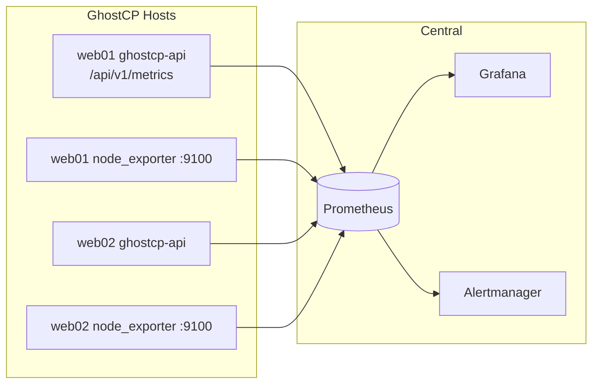

# Metrics — Prometheus

> **Partly implemented.** GhostCP exposes a Prometheus metrics endpoint **today**
> at `GET /api/v1/metrics` (public, unauthenticated). Scraping it from a central
> Prometheus and the node-level exporters below is the standard
> [central-aggregator](README.md) integration.

GhostCP is designed to be scraped, not to scrape. A central Prometheus pulls
metrics from each GhostCP host; Grafana visualizes them; Alertmanager fires on
thresholds.

## What GhostCP exposes

| Source | Endpoint | Auth | Status |
|--------|----------|------|--------|
| `ghostcp-api` | `/api/v1/metrics` | none | **implemented** |
| `node_exporter` | `:9100/metrics` | none | host package (recommended) |
| `cAdvisor` | `:8085/metrics` | none | only if running containers |

The panel endpoint surfaces the same monitoring data the UI reads through
`/api/v1/monitoring/*` (CPU, memory, disk, network, service status) in
Prometheus exposition format. It is intentionally public so a scraper needs no
token; restrict access at the network layer (bind/firewall) rather than with
auth, exactly as `node_exporter` is treated.

## Scrape configuration

On the central Prometheus, add each GhostCP host. Example
`prometheus.yml` jobs:

```yaml
scrape_configs:
  - job_name: ghostcp-api
    metrics_path: /api/v1/metrics
    static_configs:
      - targets:
          - web01.example.internal:8080
          - web02.example.internal:8080
        labels:
          source_type: panel

  - job_name: node
    static_configs:
      - targets:
          - web01.example.internal:9100
          - web02.example.internal:9100
        labels:
          source_type: host
```

If the panel sits behind the [reverse proxy](../deployment/reverse-proxy.md),
scrape it through the proxy on 443 with `scheme: https` instead of hitting 8080
directly.

## Flow



## Dashboards & alerts

- **node_exporter** drives the standard host dashboards (CPU/mem/disk/net) — the
  community "Node Exporter Full" dashboard works unchanged.
- **`ghostcp-api`** metrics let you build a panel-health dashboard (service
  up/down, request volume) and alert on the API being down or a managed service
  (NGINX/Postfix/BIND) reporting unhealthy.

Keep alert *rules* and *routing* on the central stack (Prometheus +
Alertmanager). GhostCP hosts only expose; they don't evaluate.

## Related

- [Logging](logging.md) — the Loki side of the stack
- [CrowdSec metrics](../security/crowdsec.md) — LAPI also exports Prometheus
  metrics (`:6060`) that the same Prometheus can scrape
