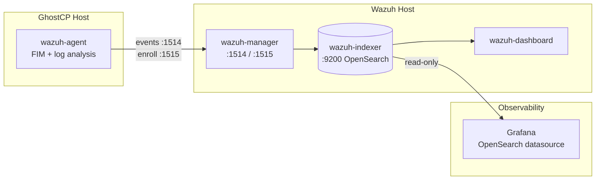

# SIEM — Wazuh

> **Integration design — planned.** GhostCP ships no Wazuh components. This page
> describes running a **Wazuh agent** on a GhostCP host and pointing it at an
> existing Wazuh manager/indexer in a [central observability](README.md) stack.
> The manager, indexer, and dashboard live on their own host.

Where [logging](logging.md) and [metrics](metrics.md) answer "what happened" and
"how loaded," **Wazuh** answers "is this host being tampered with." On a GhostCP
host that matters most for **file integrity monitoring (FIM)** of generated
config and **log-based threat detection**.

## Topology



The Wazuh manager processes agent events and writes alerts to the indexer
(OpenSearch on `:9200`). The central Grafana reads those alerts **read-only**
through an OpenSearch datasource — it does not run Wazuh.

## Agent install (GhostCP host)

Install the Wazuh agent from the Wazuh repo, point it at the manager, and
enroll:

```bash
WAZUH_MANAGER="wazuh.example.internal" apt install wazuh-agent
/var/ossec/bin/agent-auth -m wazuh.example.internal   # enrollment on :1515
systemctl enable --now wazuh-agent
```

Outbound `1514/tcp` (events) and `1515/tcp` (enrollment) to the manager must be
permitted — see [Proxmox firewall](../deployment/proxmox-firewall.md) if the
host is a PVE VM.

## What to watch on a GhostCP host

GhostCP *generates* service config from templates. FIM on those paths catches
both legitimate panel changes and tampering. Add to the agent's
`ossec.conf` `<syscheck>`:

```xml
<syscheck>
  <directories check_all="yes" report_changes="yes">/etc/nginx</directories>
  <directories check_all="yes" report_changes="yes">/etc/postfix</directories>
  <directories check_all="yes" report_changes="yes">/etc/dovecot</directories>
  <directories check_all="yes" report_changes="yes">/etc/bind</directories>
  <directories check_all="yes">/etc/ghostcp</directories>
</syscheck>
```

Pair FIM with Wazuh's built-in log decoders for `sshd`, web, and mail so brute
force and web attacks raise alerts in addition to
[CrowdSec](../security/crowdsec.md) enforcement.

## Grafana datasource (central side)

The indexer is queried from Grafana with the OpenSearch datasource pointed at
`https://wazuh.example.internal:9200`. One gotcha: the Wazuh alerts index uses a
**date-math** name, not a literal wildcard. Configure the index pattern as:

```
[wazuh-alerts-4.x-]YYYY.MM.DD
```

with a daily time field of `timestamp`. Using a literal `wazuh-alerts-4.x-*`
string will return no data.

## Division of labor

| Concern | Engine | Where it runs |
|---------|--------|---------------|
| FIM + log-based detection | Wazuh agent | GhostCP host |
| Alert storage/correlation | Wazuh manager + indexer | Wazuh host |
| IPS enforcement (ban IPs) | [CrowdSec](../security/crowdsec.md) | GhostCP host + LAPI |
| Visualization | Grafana | observability host |

Enforcement stays on the GhostCP host; the center only observes.

## Related

- [Logging](logging.md) · [Metrics](metrics.md)
- [CrowdSec](../security/crowdsec.md) — complementary IPS
- [Hardening](../security/hardening.md)
