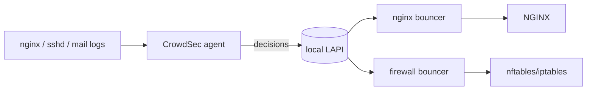
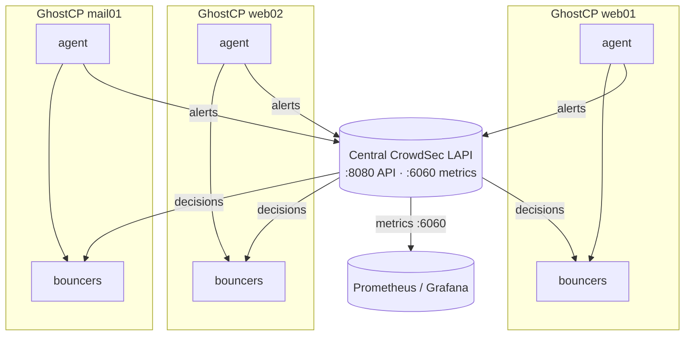
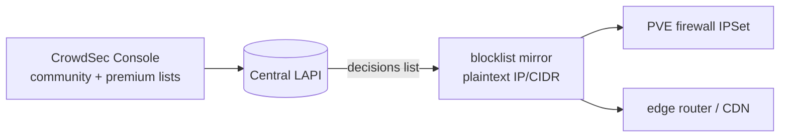

# CrowdSec — IPS for GhostCP hosts

> **Integration design — planned.** GhostCP does not bundle CrowdSec. This page
> documents running the CrowdSec agent and bouncers on a GhostCP host and wiring
> it into a central **LAPI** so a fleet shares decisions and blocklists. The
> central API and console enrollment live off-box; enforcement runs on the
> GhostCP host.

A GhostCP host serves public web, mail, and DNS — exactly the surface CrowdSec is
built to defend. CrowdSec parses local logs, detects attack patterns (brute
force, web probing, mail abuse), and issues **decisions** (bans). **Bouncers**
enforce those decisions at NGINX and the firewall.

## Modernizing HestiaCP's fail2ban

HestiaCP defends hosts with **fail2ban**: regex over log files, per-host bans
written to iptables. It works, but it's local-only, regex-brittle, and shares
nothing between servers. GhostCP positions **CrowdSec** as the modern
replacement:

| | HestiaCP `fail2ban` | GhostCP CrowdSec |
|--|---------------------|------------------|
| Detection | per-host regex jails | shared scenarios + parsers |
| Enforcement | iptables only | **firewall bouncer** (nft/iptables) + **NGINX bouncer** |
| Web layer | none (IP-only) | NGINX bouncer can `403`/captcha before PHP runs |
| Sharing | none | central LAPI + community/premium blocklists |
| Signal out | none | Prometheus metrics, blocklist mirror |

Two bouncers do the enforcing:

- **firewall-bouncer** — drops banned IPs at **nftables/iptables**, covering all
  protocols (SSH, mail, DNS), exactly where fail2ban acted but fleet-aware.
- **nginx-bouncer** — enforces at the web tier, returning `403` or a captcha to
  banned IPs *before* requests reach WordPress/PHP-FPM — something fail2ban's
  IP-only model can't do as precisely.

## Components

| Piece | Role | Runs on |
|-------|------|---------|
| **Agent** | parse logs, run scenarios, raise decisions | GhostCP host |
| **Bouncers** | enforce decisions (block/ captcha) | GhostCP host (nginx, firewall) |
| **LAPI** | decision API + DB the agent/bouncers talk to | local, or **central** for a fleet |
| **Console** | optional SaaS dashboard + central blocklists | cloud (enrollment) |

## Single host

The simplest deployment runs agent + a local LAPI + bouncers on the one host:



Install and add the NGINX + firewall bouncers:

```bash
apt install crowdsec
apt install crowdsec-nginx-bouncer crowdsec-firewall-bouncer-nftables
cscli collections install crowdsecurity/nginx crowdsecurity/sshd
```

Point the agent at the local logs (NGINX access/error, `journald` for `sshd`,
Postfix/Dovecot) via `/etc/crowdsec/acquis.yaml`.

## Distributed fleet — central LAPI

For multiple GhostCP hosts, run **one central LAPI** and register every host's
agent and bouncers against it. A decision raised on `web01` is then enforced on
every node, and you manage bans in one place.



On the central LAPI host, register each remote machine and each bouncer:

```bash
# on the LAPI host — create a credential per agent and per bouncer
cscli machines add web01-agent  --auto
cscli bouncers add web01-nginx
```

On each GhostCP host, set `api.client.credentials` in
`/etc/crowdsec/local_api_credentials.yaml` to the central LAPI URL and the issued
key, and set `api.server.enable: false` so the host runs **agent-only** (no local
LAPI).

## Blocklist mirror / central blocklists

CrowdSec's value compounds with shared blocklists. Two layers:

1. **Community + premium blocklists** — enroll the central LAPI in the CrowdSec
   **Console** (`cscli console enroll <token>`) to subscribe the whole fleet to
   curated blocklists pushed into the LAPI.
2. **Self-hosted blocklist mirror** — expose the LAPI's aggregated decisions as a
   plain blocklist (one IP/CIDR per line) that other tooling (edge firewalls,
   PVE, upstream routers) can pull on a schedule. This makes GhostCP's CrowdSec a
   **source** of blocking signal for infrastructure that doesn't run a bouncer.



## Observe-only at the center

A [central observability](../observability/README.md) aggregator does **not** run
CrowdSec — it scrapes the LAPI's Prometheus metrics (`:6060`) for dashboards and
alerts:

```yaml
# central prometheus.yml
  - job_name: crowdsec
    static_configs:
      - targets: ["lapi.example.internal:6060"]
```

Enable that endpoint in `/etc/crowdsec/config.yaml`:

```yaml
prometheus:
  enabled: true
  level: full
  listen_addr: 0.0.0.0
  listen_port: 6060
```

## Division of labor

- **Enforcement** (parsing, decisions, bans) stays on the GhostCP hosts.
- **Sharing** (fleet decisions, blocklists) is the central LAPI's job.
- **Visibility** (metrics, alerts) is the observability stack's job — read-only.

## Related

- [Hardening](hardening.md) — the rest of host hardening
- [Observability](../observability/README.md) — metrics/logs/SIEM context
- [Distributed deployment](../deployment/distributed.md) — multi-host GhostCP
- [Proxmox firewall](../deployment/proxmox-firewall.md) — where a blocklist
  mirror can feed a PVE IPSet
