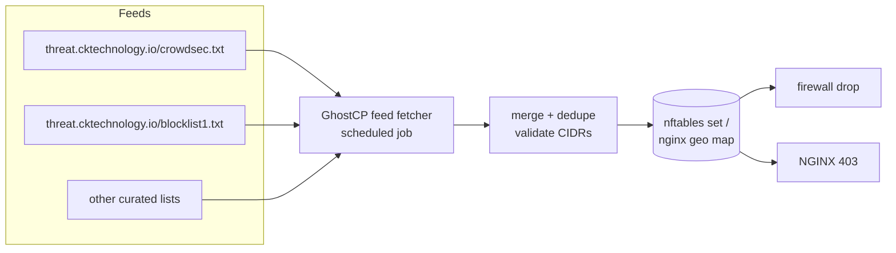

# Threat feeds — importing IP blocklists

> **Planned feature.** GhostCP does not yet ingest external blocklists. This page
> specifies the intended design: subscribe a GhostCP host to one or more remote
> **threat feeds** (plaintext IP/CIDR lists) and enforce them at NGINX and the
> firewall, alongside [CrowdSec](crowdsec.md) decisions.

CrowdSec generates blocking signal from *this host's* logs. **Threat feeds** add
externally-curated blocking signal — IPs already known-bad elsewhere — so a host
blocks them before they ever trip a local scenario. GhostCP imports feeds as
plain lists of one IP or CIDR per line.

## Feed sources

A feed is just an HTTP(S) URL returning newline-delimited IPs/CIDRs. GhostCP can
subscribe to several, including self-hosted aggregations such as the
CK Technology feeds:

```
https://threat.cktechnology.io/crowdsec.txt
https://threat.cktechnology.io/blocklist1.txt
```

`crowdsec.txt` is the [CrowdSec LAPI blocklist mirror](crowdsec.md#blocklist-mirror--central-blocklists)
— the fleet's own aggregated decisions republished as a flat list — so other
hosts (or other infrastructure entirely) can consume GhostCP's blocking signal
without running a bouncer. Additional `blocklistN.txt` files hold other curated
sets (scanners, spam sources, abuse feeds).

Each feed entry carries a few attributes:

| Field | Example | Meaning |
|-------|---------|---------|
| `url` | `https://threat.cktechnology.io/crowdsec.txt` | where to fetch |
| `name` | `ck-crowdsec` | label for logs/UI |
| `interval` | `15m` | refresh cadence |
| `action` | `deny` / `tarpit` | what enforcement does |
| `enabled` | `true` | toggle without removing |

## Fetch → merge → enforce



The intended pipeline:

1. **Fetch** each enabled feed on its `interval` (a scheduled
   [job](../architecture/jobs.md)), with ETag/Last-Modified caching so unchanged
   feeds are cheap.
2. **Validate & merge** — parse lines, drop comments/blanks, validate each as a
   v4/v6 IP or CIDR, dedupe across feeds.
3. **Enforce** at two layers:
   - **Firewall:** load the merged set into a named `nftables` set the input
     chain drops — efficient for arbitrary protocols (mail, DNS, SSH).
   - **NGINX:** render an `geo`/`map` include so web requests from listed IPs get
     `403`, with the client IP still logged for [observability](../observability/README.md).

## Enforcement examples (design)

nftables set, refreshed atomically by the fetcher:

```
table inet filter {
    set threatfeed {
        type ipv4_addr
        flags interval
        elements = { 203.0.113.0/24, 198.51.100.7 }
    }
    chain input {
        ip saddr @threatfeed drop
    }
}
```

NGINX deny include, generated from the merged list:

```nginx
# /etc/nginx/conf.d/threatfeed.conf  (generated)
geo $threat_blocked {
    default 0;
    203.0.113.0/24 1;
    198.51.100.7   1;
}
# in a server/location:
#   if ($threat_blocked) { return 403; }
```

## Protecting hosted static & WordPress sites

The main payoff is at the web edge: every static and WordPress site GhostCP
serves sits behind the same NGINX, so a single generated threat-feed include
shields **all** hosted sites at once — the way a commercial WAF/firewall ships a
managed blocklist.

- **Static sites** get drops for free — known scanners/bots never reach the
  files. No per-site config; the feed applies at the server/http level.
- **WordPress** is the bigger win: `wp-login.php` and `xmlrpc.php` are constant
  brute-force/credential-stuffing targets. Feed-listed IPs are `403`'d before
  PHP-FPM ever runs, cutting load and locking out known-bad sources ahead of any
  plugin-level protection.

Apply the feed at the `http` level so it covers every vhost, then optionally
tighten sensitive WordPress endpoints:

```nginx
# http-level: every hosted site inherits the feed
if ($threat_blocked) { return 403; }

# extra guard on WP login/xmlrpc (per-site template)
location = /wp-login.php { if ($threat_blocked) { return 403; } }
location = /xmlrpc.php   { return 403; }   # usually disabled outright
```

This pairs with [CrowdSec](crowdsec.md) (which *adds* attackers it observes
hitting those same endpoints) and the per-site isolation in
[WordPress hosting](../websites/wordpress.md): feeds block known-bad up front,
CrowdSec catches the rest, PHP-FPM pools contain blast radius.

## Operational notes

- **Fail open on fetch error.** If a feed URL is unreachable, keep the last good
  copy; never flush enforcement to empty because a download failed.
- **Size limits.** Cap total entries and reject feeds that balloon unexpectedly
  (a corrupted feed shouldn't blackhole the internet).
- **Allowlist precedence.** Always evaluate a local allowlist (your admin CIDRs,
  the [Tailscale](../deployment/tailscale.md) range) *before* feed drops so a
  bad entry can't lock you out.
- **Feed of feeds.** Because GhostCP can both **publish** (`crowdsec.txt` mirror)
  and **consume** feeds, a fleet can share blocking signal peer-to-peer without a
  central enforcement point.

## Related

- [CrowdSec](crowdsec.md) — generates the decisions that back `crowdsec.txt`
- [Hardening](hardening.md)
- [Proxmox firewall](../deployment/proxmox-firewall.md) — an IPSet can pull the
  same feed at the PVE layer
- [Jobs](../architecture/jobs.md) — the scheduler that refreshes feeds
